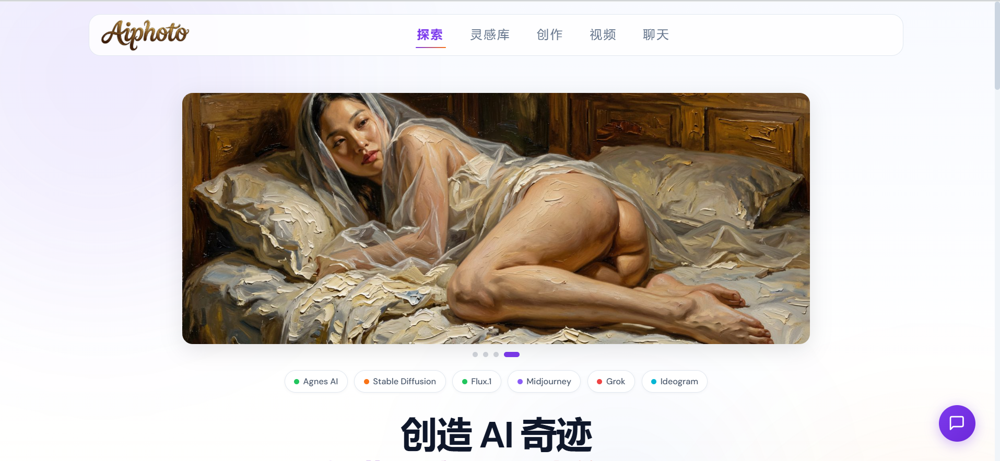

# Aiphoto - WordPress AI 图片展示主题

<div align="center">

**🌐 主站：[青衣网络](https://ra0.cn)** | **🎨 AI 图片站：[Aiphoto](https://aiphoto.ra0.cn)**

由]用心打造(https://aiphoto.ra0.cn)

</div>

一个现代化的 WordPress 主题，专注于 AI 生成图片的展示与在线创作。


## 功能特性

- **在线图片生成** - 首页 Hero 区域集成 AI 图片生成器
- **文生图 + 图生图** - 支持纯文本生成和参考图生成
- **瀑布流画廊** - 响应式 Masonry 布局展示图片
- **分类筛选** - 支持按分类和风格筛选图片
- **API 后台配置** - 在 WordPress 后台轻松配置 API
- **白色主题** - 简洁现代的 AI-Native UI 设计风格
- **响应式设计** - 完美适配桌面端、平板和手机
- **灯箱效果** - 点击图片全屏查看
- **懒加载** - 图片延迟加载提升性能
- **无障碍访问** - 符合 WCAG AA 标准
- **AI 聊天** - 内置 AI 智能聊天功能

## 安装步骤

### 1. 上传主题

将 `aiphoto-theme` 文件夹上传到 WordPress 的 `wp-content/themes/` 目录。

### 2. 激活主题

进入 WordPress 后台 → 外观 → 主题，找到 "Aiphoto" 并点击"启用"。

### 3. 配置 API

**配置你的 API：

- **API 密钥**: 输入你的 API 密钥
- **API 基础 URL**: 默认`https://apihub.agnes-ai.com`
**: 选择模型（默认

### 4. 创建页面

主题会自动创建以下页面：
- **生成图片** (`/generate`) - AI 图片生成页面
- **画廊** (`/gallery`) - 图片画廊展示
- **聊天** (`/chat`) - AI 智能聊天

### 5. 设置菜单

进入 **外观 → 菜单**，创建主菜单并分配给 "Primary Menu" 位置。

## 自定义帖子类型

主题自动注册了以下功能：

- **AI Photo** (`ai_photo`) - 自定义帖子类型，用于存储图片
- **Photo Category** (`photo_category`) - 分类法，用于图片分类
- **Photo Style** (`photo_style`) - 分类法，用于图片风格标签

## 支持的 API

主题支持任何兼容 OpenAI 接口的 API，包括：

-Agnes AI（默认）
- OpenAI DALL-E 3
- OpenAI DALL-E 2
-Stable Diffusion（通过兼容接口）
- 其他 OpenAI 兼容的图片生成 API

## 设计系统

### 配色

|标记|值|用途|
|-------|-------|------|
|主色| `#7c3aed` |品牌色（紫色）|
| Accent | `#F97316` | 强调色（珊瑚橙） |
| Background | `#ffffff` | 白色背景 |
| Surface | `#f8fafc` | 卡片表面 |
|前景| `#0f172a` |主要文字|
| Border | `#e2e8f0` | 边框颜色 |

### 字体

- **主字体**: DM Sans
- **等宽字体**: JetBrains Mono
- **来源**: Google Fonts

### 间距

采用 8pt 间距系统：4px, 8px, 16px, 24px, 32px, 48px, 64px, 96px

## 文件结构

```
aiphoto-theme/
├── style.css                  # 主题样式 & 元数据
├── functions.php              # 主题功能 & AJAX 处理
├── header.php                 # 头部模板
├── footer.php                 # 底部模板
├── front-page.php             # 首页模板（文生图/图生图/画廊）
├── page-chat.php              # 聊天页面模板
├── page-gallery.php           # 画廊页面模板
├── single-ai-photo.php        # 单张图片模板
├── assets/
│   ├── css/
│   │   ├── custom.css         # 额外样式
│   │   ├── editor-style.css   # 编辑器样式
│   │   └── page-styles.css    # 页面样式
│   ├── js/
│   │   └── main.js            # 主 JavaScript
│   └── images/                # 主题图片资源
├── template-parts/            # 模板部分
└── inc/                       # 包含文件目录（预留）
```

## 浏览器兼容性

- Chrome 90+
- Firefox 88+
- Safari 14+
- Edge 90+

## 技术要求

- WordPress 6.0+
- PHP 7.4+

## 许可证

GNU通用公共许可证第2版或更高版本

## 贡献

欢迎提交 Issue 和 Pull Request！

## 更新日志

### v2.2.0 (2026-07-16)

- 新增语音聊天功能
- 优化聊天侧边栏布局（修复被页头遮挡问题）
- 优化图片压缩算法（WebP 格式，最大边 600px，质量 50）
- 修复文生图保存到媒体库的问题
- 改进图生图功能
- 更新 AI 助手身份标识

### v2.1.0 (2026-07-16)

- 修复聊天页面侧边栏布局问题
- 优化图片压缩算法（WebP 格式，最大边 600px）
- 修复文生图保存到媒体库的问题
- 改进图生图功能

###v2.0.0（2026-07-14）

- 全新白色主题设计
- 新增图生图功能
- 优化图片压缩算法（WebP 格式）
- 修复版本号和配色文档

### v1.0.0 (2026-07-12)

- 初始版本发布
- 集成 OpenAI 兼容 API
- 瀑布流画廊
- 深色 AI-Native UI 设计
- 响应式布局

---

<div align="center">

**🌐 主站：[ra0.cn](https://ra0.cn)** | **🎨 AI 图片站：[aiphoto.ra0.cn](https://aiphoto.ra0.cn)**

Made with ❤️ by [Aiphoto](https://aiphoto.ra0.cn)

</div>
